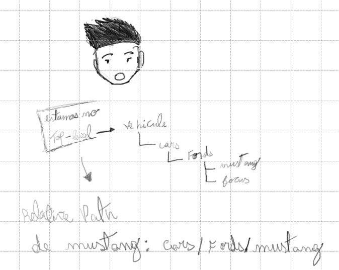

# Shell e filesystems

Project : Learn Shells and Terminals (https://www.notion.so/Learn-Shells-and-Terminals-123720ce54ce809f96e9d53699f34755?pvs=21)
Status: In reviewing
Tags: Estudos, backend

Shell ou REPL é o programa que executa os comandos

shell: bash and zsh

terminal é o que permite inputs baseados em texto

`expr 123456 + 7890` → analisa e executa operações matematicas basicas

pwd: pitput será o *filepath*

baixando um diretorio(pasta) do github

```bash
curl -L https://github.com/bootdotdev/worldbanc/archive/refs/heads/main.zip -o worldbanc.zip
unzip worldbanc.zip
rm worldbanc.zip
mv worldbanc-main worldbanc
sudo chown -R $(whoami) worldbanc
sudo chmod -R 755 worldbanc
```

## **Absolute vs Relative Paths**

**relative:**



**absolute: é mais explicito** 

começa no root do sistema.

ou seja, se vehicles está no root do usuario, o `absolute filepath` de mustang será:

`/vehicles/cars/fords/mustang.txt`

> files are just blobs of data.
> 

o comando cat, significa “concatenate”, serve para visualizarmos dados de varios arquivos no terminal:

`cat pr.ideas.txt`

```bash
Money Trees for Everyone!: We are literally invested in the environment!
WorldBanc will plant a tree for every new account opened.
But here's the twist – each tree will be adorned with fake dollar bills featuring the CEO's face.
Customers can come and 'harvest' the faux cash from their personal trees, exchanging it for real money at a hilariously low exchange rate.

WorldBanc Cares: Recognizing the importance of personal touch in the digital age,
we introduce a new campaign where the CEO personally writes an email to every customer Mr. Beast style.
To top it off, each email signs off with a digitally autographed photo of the CEO giving a thumbs up.

The WorldBanc Blimp Bonanza: The best way to stay 'above' the competition is quite literal – by investing in a fleet of blimps.
These blimps, emblazoned with the WorldBanc logo, will hover over major cities, occasionally dropping WorldBanc-branded swag like pens, notepads, and stress balls.
The pièce de résistance? Each blimp plays a jingle, the lyrics of which are just the company's stock ticker symbol repeated to a catchy tune.
```

## cat vs head vs tail

`cat:` printa todo conteúdo dentro do arquivo

`head -n 10 file1.txt :` printa as 10 primeiras linhas

`less -N 2023.csv:` comando para exibir o conteudo dos arquivos + a linha

## touch

`touch new_file.txt:` cria um arquivo 

## mkdir

